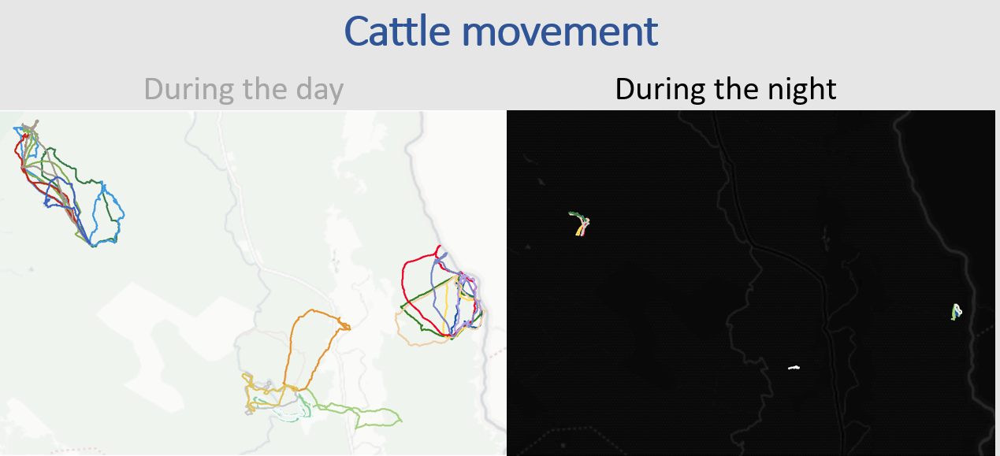

# cattle

Code for day 5 of the [30DayMapChallenge](https://30daymapchallenge.com/)

Used cattle data from [Movebank](https://www.movebank.org/cms/movebank-main)

Citation for the source data:

Moritz M. 2018. Data from: An integrated approach to modeling grazing pressure in pastoral systems: the case of the Logone Floodplain (Cameroon). Movebank Data Repository. [https://doi.org/10.5441/001/1.j682ds56](https://www.doi.org/10.5441/001/1.j682ds56)

Moritz M, Soma E, Scholte P, Xiao N, Taylor L, Juran T, Kari S. 2010. An integrated approach to modeling grazing pressure in pastoral systems: the case of the Logone Floodplain (Cameroon). Hum Ecol. 38(6):775 [https://doi.org/10.1007/s10745-010-9361-z](https://doi.org/10.1007/s10745-010-9361-z)

Technologies used (more details in the notebook):

- Python

- [Leafmap](https://leafmap.org/) package of Dr. Qiusheng Wu and more specifically [Leafmap.deckgl](https://leafmap.org/deckgl/)

- [Lonboard](https://developmentseed.org/lonboard/latest/) framework from Development Seed

- Used tutorials of [Spatial Thoughts](https://spatialthoughts.com/courses/python-dataviz/), QGIS tutorial of [https://ecodiv.earth/](https://ecodiv.earth/post/animal_tracking-data/#ref-moritz2018) and [Dr Quisheng Wu](https://www.youtube.com/playlist?list=PLAxJ4-o7ZoPfb18kNe2luWX9xKg1233i9)

The final images (interactive) where put together into a PPT (main image above).

## Notebooks

1. [prepare_data](prepare_data.ipynb): This takes the original .csv file from Movebank and convert it into a Geopandas dataframe for further analysis. Very basic plotting.

2. [basics_lonboard_cattle]('notebooks/basics_lonboard_cattle.ipynb) - Main analysis using the Leaflet/DeckGL backend.

To interactively view the html files that are created in Leafmap, please navigate to:

- https://ellenb.github.io/30DayMapChallenge/day_cattle.html

- https://ellenb.github.io/30DayMapChallenge/day_cattle.html

Other:

[ppt](ppt/cattle.pdf)
